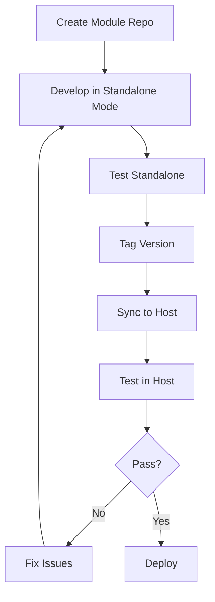

# Modular Next.js Architecture Guide

> **Building Feature Modules as Standalone Apps with Plug-and-Play Integration**

**Version**: 1.0.0  
**Last Updated**: October 9, 2025  
**Project**: TASKMANAGEMENT

---

## Table of Contents

1. [Overview](#overview)
2. [Architecture Principles](#architecture-principles)
3. [Core Concepts](#core-concepts)
4. [Directory Structure](#directory-structure)
5. [Implementation Phases](#implementation-phases)
6. [Module Development Guide](#module-development-guide)
7. [Host Platform Setup](#host-platform-setup)
8. [Sync & Integration Process](#sync--integration-process)
9. [Best Practices](#best-practices)
10. [Common Pitfalls](#common-pitfalls)
11. [FAQ](#faq)

---

## Overview

### The Challenge

Build feature modules that can:
- Run as **standalone Next.js applications** for independent development
- **Plug-and-play** into a main platform under the same domain
- Share state, routing, and UI consistency
- Maintain build-time composition (not runtime micro-frontends)

### The Solution

**Build-time composition** of multi-repo modules with:
- Explicit integration contracts
- Versioned platform API
- Static, type-safe composition
- Single domain deployment

### Why Not Micro-Frontends?

- Avoid runtime loading complexity
- Preserve SSR and React Server Components
- Maintain type safety across boundaries
- Simpler dependency management
- Better performance (single bundle)

---

## Architecture Principles

### 1. Build-Time Composition Over Runtime Loading
Modules are copied into the host at build time, not loaded dynamically. This ensures:
- Full SSR support
- Type safety
- Single optimized bundle
- No version conflicts at runtime

### 2. Explicit Over Implicit
- Manual module registration (no auto-discovery)
- Versioned contracts
- Clear dependency declarations
- Auditable integration

### 3. Single Source of Truth
- Module core lives in one repo
- Synced to host via immutable Git tags
- Host owns shared infrastructure

### 4. Dual-Life Modules
Each module runs in two modes:
- **Standalone**: Full Next.js app for development
- **Embedded**: Core features integrated into host

---

## Core Concepts

### Module Anatomy

```
module-repo/
├── app/                          # Standalone shell (never synced)
│   ├── layout.tsx                # Standalone layout
│   ├── page.tsx                  # Landing page
│   ├── providers.tsx             # Module providers
│   └── globals.css               # Standalone styles
├── src/
│   ├── app/                      # Module core (SYNCED to host)
│   │   ├── dashboard/
│   │   ├── settings/
│   │   └── components/
│   └── platform-integration/     # Integration contracts (SYNCED)
│       ├── module-descriptor.ts  # Redux/state integration
│       ├── module.routes.json    # Route manifest
│       └── navigation.ts         # Nav/sidebar config
├── module.json                   # Module manifest
└── package.json                  # Dependencies
```

### Host Platform Anatomy

```
host-app/
├── src/
│   ├── platform/
│   │   └── v1/                   # Stable platform API
│   │       ├── auth/             # Auth utilities
│   │       ├── api/              # API client
│   │       ├── components/       # UI primitives
│   │       ├── config/           # Configuration
│   │       └── types/            # Shared types
│   ├── app/
│   │   ├── accounting/           # Synced module
│   │   ├── crm/                  # Synced module
│   │   └── tasks/                # Synced module
│   └── lib/
│       ├── modules/              # Module descriptors
│       │   ├── accounting.ts
│       │   └── crm.ts
│       └── redux/
│           └── registry.ts       # Generated store config
├── modules/                      # Module metadata
│   ├── accounting.json
│   └── crm.json
├── modules.lock.json             # Version lockfile
└── scripts/
    └── sync-module.mjs           # Sync automation
```

---

## Directory Structure

### Current TASKMANAGEMENT Structure

```
frontend/
├── app/
│   ├── (main_app)/
│   │   ├── (auth)/
│   │   └── (dashboard)/
│   ├── layout.tsx
│   └── providers.tsx
├── store/
│   ├── auth/
│   ├── miscellaneous/
│   ├── notifications/
│   ├── redirects/
│   ├── rootReducer.ts
│   └── rootSaga.ts
├── lib/
│   ├── api/
│   ├── apiRequest.ts
│   └── helpers/
├── components/
└── package.json
```

### Target Module Structure

```
task-management-module/
├── app/                          # Standalone mode
│   ├── layout.tsx
│   ├── page.tsx
│   └── providers.tsx
├── src/
│   ├── app/                      # Core features
│   │   ├── dashboard/
│   │   ├── projects/
│   │   ├── completed-tasks/
│   │   └── failed-tasks/
│   └── platform-integration/
│       ├── module-descriptor.ts
│       └── module.routes.json
├── module.json
└── package.json
```

### Target Host Structure

```
frontend/
├── src/
│   ├── platform/
│   │   └── v1/
│   │       ├── auth/index.ts
│   │       ├── api/index.ts
│   │       ├── components/index.ts
│   │       └── types/module.ts
│   ├── app/
│   │   ├── tasks/               # Synced from task-management
│   │   └── layout.tsx
│   └── lib/
│       ├── modules/
│       │   └── tasks.ts
│       └── redux/
│           └── registry.ts
├── modules.lock.json
└── scripts/
    └── sync-module.mjs
```

---

## Implementation Phases

### Phase 1: Foundation Setup (Days 1-2)

**Goal**: Create platform API surface and module contracts

#### Step 1.1: Create Platform API Structure

```bash
mkdir -p src/platform/v1/{auth,api,components,config,types}
```

**Files to create**:

1. **`src/platform/v1/types/module.ts`**
```typescript
import { Reducer, AnyAction } from '@reduxjs/toolkit';

export interface ModuleDescriptor {
  name: string;
  version: string;
  platformVersion: string;
  routeBasePath: string;
  routes: string[];
  slices: Record<string, Reducer<any, AnyAction>>;
  sagas?: Array<() => Generator>;
  rtkApis?: Array<{
    reducerPath: string;
    reducer: any;
    middleware: any;
  }>;
  peerDeps: Record<string, string>;
}
```

2. **`src/platform/v1/auth/index.ts`**
```typescript
// Platform auth utilities
export { getSession } from './getSession';
export { hasPermission } from './permissions';
export type { Session, User } from './types';
```

3. **`src/platform/v1/api/index.ts`**
```typescript
// Re-export API client from existing lib
export { apiRequest } from '@/lib/apiRequest';
export type { ApiConfig, ApiResponse } from '@/lib/apiRequest';
```

4. **`src/platform/v1/components/index.ts`**
```typescript
// Re-export UI primitives
export * from '@/components/ui/button';
export * from '@/components/ui/card';
export * from '@/components/ui/dialog';
// ... other primitives
```

5. **`src/platform/v1/config/index.ts`**
```typescript
export type PlatformConfig = {
  apiBaseUrl: string;
  locale: string;
  timezone: string;
};

export const getServerConfig = (): PlatformConfig => ({
  apiBaseUrl: process.env.NEXT_PUBLIC_API_URL ?? 'http://localhost:8000',
  locale: process.env.NEXT_PUBLIC_LOCALE ?? 'en-US',
  timezone: process.env.NEXT_PUBLIC_TIMEZONE ?? 'UTC',
});
```

#### Step 1.2: Update TypeScript Configuration

Add to `tsconfig.json`:
```json
{
  "compilerOptions": {
    "paths": {
      "@/*": ["./src/*"],
      "@/platform/*": ["./src/platform/*"],
      "@/platform/v1/*": ["./src/platform/v1/*"]
    }
  }
}
```

#### Step 1.3: Create Module Manifest Schema

Create `schemas/module.schema.json`:
```json
{
  "$schema": "http://json-schema.org/draft-07/schema#",
  "type": "object",
  "required": ["name", "version", "platformVersion", "mountPath", "routes"],
  "properties": {
    "name": {
      "type": "string",
      "pattern": "^[a-z][a-z0-9-]*$"
    },
    "version": {
      "type": "string",
      "pattern": "^\\d+\\.\\d+\\.\\d+$"
    },
    "platformVersion": {
      "type": "string",
      "description": "Semver range for compatible platform versions"
    },
    "mountPath": {
      "type": "string",
      "pattern": "^/[a-z][a-z0-9-]*$"
    },
    "routes": {
      "type": "array",
      "items": {
        "type": "string",
        "pattern": "^/"
      }
    },
    "peerDeps": {
      "type": "object",
      "additionalProperties": {
        "type": "string"
      }
    }
  }
}
```

---

### Phase 2: Refactor Current App (Days 3-5)

**Goal**: Transform existing app into first module

#### Step 2.1: Create Module Repository

```bash
# Create new repo for task-management module
mkdir -p task-management-module
cd task-management-module
git init
```

#### Step 2.2: Set Up Module Structure

```bash
mkdir -p app
mkdir -p src/app
mkdir -p src/platform-integration
```

#### Step 2.3: Move Current Features

1. **Copy dashboard routes to module core**:
```bash
cp -r frontend/app/(main_app)/(dashboard)/* task-management-module/src/app/
```

2. **Create standalone shell**:

`task-management-module/app/layout.tsx`:
```typescript
import { ReduxProvider } from '@/providers/ReduxProvider';
import '../globals.css';

export default function RootLayout({
  children,
}: {
  children: React.ReactNode;
}) {
  return (
    <html lang="en">
      <body>
        <ReduxProvider>
          {children}
        </ReduxProvider>
      </body>
    </html>
  );
}
```

`task-management-module/app/page.tsx`:
```typescript
import Link from 'next/link';

export default function Home() {
  return (
    <div>
      <h1>Task Management Module</h1>
      <nav>
        <Link href="/dashboard">Dashboard</Link>
        <Link href="/projects">Projects</Link>
      </nav>
    </div>
  );
}
```

#### Step 2.4: Create Module Descriptor

`task-management-module/src/platform-integration/module-descriptor.ts`:
```typescript
import type { ModuleDescriptor } from '@/platform/v1/types/module';
import { authReducer } from '@/store/auth/reducer';
import { miscReducer } from '@/store/miscellaneous/reducer';
import { redirectsReducer } from '@/store/redirects/reducer';
import { notificationsReducer } from '@/store/notifications/reducer';
import { authSaga } from '@/store/auth/saga';
import { miscSaga } from '@/store/miscellaneous/saga';

export const moduleDescriptor: ModuleDescriptor = {
  name: 'tasks',
  version: '1.0.0',
  platformVersion: '>=1.0.0 <2.0.0',
  routeBasePath: '/tasks',
  routes: [
    '/dashboard',
    '/projects',
    '/projects/[id]',
    '/task-mgt/task',
    '/task-mgt/completed-tasks',
    '/task-mgt/failed-tasks',
  ],
  slices: {
    auth: authReducer,
    miscellaneous: miscReducer,
    redirects: redirectsReducer,
    notifications: notificationsReducer,
  },
  sagas: [authSaga, miscSaga],
  peerDeps: {
    'react': '^19.1.0',
    '@reduxjs/toolkit': '^2.7.0',
    'redux-saga': '^1.3.0',
    '@tanstack/react-query': '^5.86.0',
  },
};
```

#### Step 2.5: Create Module Manifest

`task-management-module/module.json`:
```json
{
  "name": "tasks",
  "version": "1.0.0",
  "platformVersion": ">=1.0.0 <2.0.0",
  "mountPath": "/tasks",
  "routes": [
    "/dashboard",
    "/projects",
    "/projects/[id]",
    "/task-mgt/task",
    "/task-mgt/completed-tasks",
    "/task-mgt/failed-tasks"
  ],
  "peerDeps": {
    "react": "^19.1.0",
    "@reduxjs/toolkit": "^2.7.0",
    "redux-saga": "^1.3.0",
    "@tanstack/react-query": "^5.86.0"
  }
}
```

#### Step 2.6: Update Module Imports

Replace all imports in `src/app/` to use platform API:

**Before**:
```typescript
import { apiRequest } from '@/lib/apiRequest';
import { Button } from '@/components/ui/button';
```

**After**:
```typescript
import { apiRequest } from '@/platform/v1/api';
import { Button } from '@/platform/v1/components';
```

#### Step 2.7: Tag Module Version

```bash
git add .
git commit -m "feat: initial task-management module v1.0.0"
git tag v1.0.0
```

---

### Phase 3: Build Tooling (Days 6-7)

**Goal**: Create sync scripts and validation

#### Step 3.1: Create Sync Script

`scripts/sync-module.mjs`:
```javascript
#!/usr/bin/env node

import { execSync } from 'child_process';
import fs from 'fs/promises';
import path from 'path';
import { fileURLToPath } from 'url';

const __filename = fileURLToPath(import.meta.url);
const __dirname = path.dirname(__filename);

/**
 * Sync a module from a Git repository into the host app
 * 
 * Usage:
 *   node scripts/sync-module.mjs \
 *     --repo <git-url> \
 *     --tag <version-tag> \
 *     --name <module-name>
 */

async function syncModule({ repo, tag, name }) {
  console.log(`\n🔄 Syncing module: ${name}@${tag}\n`);

  const tempDir = `/tmp/module-sync-${name}-${Date.now()}`;
  const rootDir = path.join(__dirname, '..');
  const targetDir = path.join(rootDir, 'src/app', name);
  const modulesDir = path.join(rootDir, 'modules');

  try {
    // Step 1: Clone the module repo at specific tag
    console.log('📦 Cloning module repository...');
    execSync(`git clone --depth 1 --branch ${tag} ${repo} ${tempDir}`, {
      stdio: 'inherit',
    });

    // Step 2: Read and validate module.json
    console.log('✅ Validating module manifest...');
    const manifestPath = path.join(tempDir, 'module.json');
    const manifest = JSON.parse(await fs.readFile(manifestPath, 'utf-8'));

    // Basic validation
    if (manifest.name !== name) {
      throw new Error(`Module name mismatch: expected ${name}, got ${manifest.name}`);
    }

    // Step 3: Check platform compatibility
    console.log('🔍 Checking platform compatibility...');
    const hostPackage = JSON.parse(
      await fs.readFile(path.join(rootDir, 'package.json'), 'utf-8')
    );
    
    // Validate peer dependencies
    for (const [pkg, version] of Object.entries(manifest.peerDeps || {})) {
      const hostVersion = hostPackage.dependencies[pkg];
      if (!hostVersion) {
        console.warn(`⚠️  Warning: ${pkg} not found in host dependencies`);
      }
      // TODO: Add semver range checking
    }

    // Step 4: Copy module core
    console.log('📋 Copying module files...');
    const srcAppPath = path.join(tempDir, 'src/app');
    
    // Remove existing module if it exists
    try {
      await fs.rm(targetDir, { recursive: true, force: true });
    } catch (err) {
      // Ignore if doesn't exist
    }

    // Copy src/app/* to host
    await fs.mkdir(targetDir, { recursive: true });
    await copyDir(srcAppPath, targetDir);

    // Step 5: Copy module descriptor
    console.log('🔧 Copying module descriptor...');
    const descriptorSrc = path.join(
      tempDir,
      'src/platform-integration/module-descriptor.ts'
    );
    const descriptorDest = path.join(
      rootDir,
      'src/lib/modules',
      `${name}.ts`
    );
    
    await fs.mkdir(path.dirname(descriptorDest), { recursive: true });
    await fs.copyFile(descriptorSrc, descriptorDest);

    // Step 6: Update module metadata
    console.log('📝 Updating module metadata...');
    await fs.mkdir(modulesDir, { recursive: true });
    
    const metadata = {
      name: manifest.name,
      version: manifest.version,
      tag,
      syncedAt: new Date().toISOString(),
      routes: manifest.routes,
      mountPath: manifest.mountPath,
    };
    
    await fs.writeFile(
      path.join(modulesDir, `${name}.json`),
      JSON.stringify(metadata, null, 2)
    );

    // Step 7: Update lock file
    console.log('🔒 Updating modules.lock.json...');
    const lockPath = path.join(rootDir, 'modules.lock.json');
    let lock = {};
    
    try {
      lock = JSON.parse(await fs.readFile(lockPath, 'utf-8'));
    } catch (err) {
      // Create new lock if doesn't exist
    }
    
    lock[name] = {
      version: manifest.version,
      tag,
      repo,
      syncedAt: new Date().toISOString(),
      checksum: await getDirectoryChecksum(targetDir),
    };
    
    await fs.writeFile(lockPath, JSON.stringify(lock, null, 2));

    // Step 8: Generate registry (simplified for now)
    console.log('⚙️  Generating module registry...');
    await generateRegistry(rootDir);

    // Cleanup
    await fs.rm(tempDir, { recursive: true, force: true });

    console.log(`\n✨ Successfully synced ${name}@${tag}\n`);
  } catch (error) {
    console.error('\n❌ Sync failed:', error.message);
    
    // Cleanup on error
    try {
      await fs.rm(tempDir, { recursive: true, force: true });
    } catch (err) {
      // Ignore cleanup errors
    }
    
    process.exit(1);
  }
}

async function copyDir(src, dest) {
  await fs.mkdir(dest, { recursive: true });
  const entries = await fs.readdir(src, { withFileTypes: true });

  for (const entry of entries) {
    const srcPath = path.join(src, entry.name);
    const destPath = path.join(dest, entry.name);

    if (entry.isDirectory()) {
      await copyDir(srcPath, destPath);
    } else {
      await fs.copyFile(srcPath, destPath);
    }
  }
}

async function getDirectoryChecksum(dir) {
  // Simplified checksum - could use crypto hash
  const stats = await fs.stat(dir);
  return stats.mtime.getTime().toString();
}

async function generateRegistry(rootDir) {
  const modulesLibDir = path.join(rootDir, 'src/lib/modules');
  const registryPath = path.join(rootDir, 'src/lib/redux/registry.ts');

  // Read all module descriptors
  const moduleFiles = await fs.readdir(modulesLibDir);
  const modules = moduleFiles
    .filter(f => f.endsWith('.ts') && f !== 'index.ts')
    .map(f => f.replace('.ts', ''));

  const registryContent = `
// AUTO-GENERATED - DO NOT EDIT
// Generated at: ${new Date().toISOString()}

${modules.map(m => `import { moduleDescriptor as ${m} } from './${m}';`).join('\n')}

export const moduleDescriptors = [
${modules.map(m => `  ${m},`).join('\n')}
];
`.trim();

  await fs.writeFile(registryPath, registryContent);
}

// Parse CLI arguments
const args = process.argv.slice(2);
const params = {};

for (let i = 0; i < args.length; i += 2) {
  const key = args[i].replace('--', '');
  params[key] = args[i + 1];
}

if (!params.repo || !params.tag || !params.name) {
  console.error('Usage: sync-module.mjs --repo <url> --tag <tag> --name <name>');
  process.exit(1);
}

syncModule(params);
```

#### Step 3.2: Create ESLint Rules

`.eslintrc.modules.js`:
```javascript
module.exports = {
  rules: {
    'import/no-restricted-paths': [
      'error',
      {
        zones: [
          {
            target: './src/app/**/*',
            from: './app/**/*',
            message: 'Module core (src/app) cannot import standalone shell (app)',
          },
          {
            target: './src/app/**/*',
            from: './src/platform-integration/**/*',
            message: 'Module app cannot import platform integration',
          },
        ],
      },
    ],
    'no-restricted-imports': [
      'error',
      {
        patterns: [
          {
            group: ['@/lib/*', '!@/platform/**'],
            message: 'Modules must use @/platform API, not direct @/lib imports',
          },
        ],
      },
    ],
  },
};
```

#### Step 3.3: Add Validation Scripts

`scripts/validate-routes.mjs`:
```javascript
#!/usr/bin/env node

import fs from 'fs/promises';
import path from 'path';

async function validateRoutes() {
  const modulesDir = path.join(process.cwd(), 'modules');
  const files = await fs.readdir(modulesDir);
  
  const routes = new Map();
  const conflicts = [];

  for (const file of files) {
    if (!file.endsWith('.json')) continue;

    const content = await fs.readFile(
      path.join(modulesDir, file),
      'utf-8'
    );
    const module = JSON.parse(content);

    for (const route of module.routes) {
      const fullRoute = `${module.mountPath}${route}`;
      
      if (routes.has(fullRoute)) {
        conflicts.push({
          route: fullRoute,
          modules: [routes.get(fullRoute), module.name],
        });
      }
      
      routes.set(fullRoute, module.name);
    }
  }

  if (conflicts.length > 0) {
    console.error('\n❌ Route conflicts detected:\n');
    conflicts.forEach(c => {
      console.error(`  ${c.route}: ${c.modules.join(', ')}`);
    });
    process.exit(1);
  }

  console.log('✅ No route conflicts found');
}

validateRoutes();
```

---

### Phase 4: Integration Testing (Day 8)

**Goal**: Test module sync and host integration

#### Step 4.1: Test Module Sync

```bash
# Make sync script executable
chmod +x scripts/sync-module.mjs

# Test sync (using file:// URL for local testing)
node scripts/sync-module.mjs \
  --repo "file:///path/to/task-management-module" \
  --tag "v1.0.0" \
  --name "tasks"
```

#### Step 4.2: Update Host Store

`src/lib/redux/store.ts`:
```typescript
import { configureStore } from '@reduxjs/toolkit';
import createSagaMiddleware from 'redux-saga';
import { all } from 'redux-saga/effects';
import { moduleDescriptors } from './registry';

const sagaMiddleware = createSagaMiddleware();

// Combine all module reducers
const reducers = moduleDescriptors.reduce((acc, module) => {
  return { ...acc, ...module.slices };
}, {});

// Combine all module sagas
function* rootSaga() {
  const sagas = moduleDescriptors.flatMap(m => m.sagas || []);
  yield all(sagas.map(saga => saga()));
}

export const store = configureStore({
  reducer: reducers,
  middleware: (getDefaultMiddleware) =>
    getDefaultMiddleware({ thunk: false }).concat(sagaMiddleware),
});

sagaMiddleware.run(rootSaga);

export type RootState = ReturnType<typeof store.getState>;
export type AppDispatch = typeof store.dispatch;
```

#### Step 4.3: Verify Build

```bash
# Type check
npm run type-check

# Build
npm run build

# Validate routes
node scripts/validate-routes.mjs
```

#### Step 4.4: Test Standalone Module

```bash
cd task-management-module
npm install
npm run dev
```

Visit `http://localhost:3000` - module should work independently

---

### Phase 5: Production Readiness (Days 9-10)

**Goal**: CI/CD, error handling, monitoring

#### Step 5.1: Add CI Workflow

`.github/workflows/module-sync.yml`:
```yaml
name: Module Sync

on:
  workflow_dispatch:
    inputs:
      module_name:
        description: 'Module name'
        required: true
      module_tag:
        description: 'Module version tag'
        required: true
      module_repo:
        description: 'Module repository URL'
        required: true

jobs:
  sync:
    runs-on: ubuntu-latest
    
    steps:
      - uses: actions/checkout@v4
      
      - name: Setup Node.js
        uses: actions/setup-node@v4
        with:
          node-version: '20'
      
      - name: Install dependencies
        run: npm ci
      
      - name: Sync module
        run: |
          node scripts/sync-module.mjs \
            --repo ${{ github.event.inputs.module_repo }} \
            --tag ${{ github.event.inputs.module_tag }} \
            --name ${{ github.event.inputs.module_name }}
      
      - name: Validate routes
        run: node scripts/validate-routes.mjs
      
      - name: Type check
        run: npm run type-check
      
      - name: Build
        run: npm run build
      
      - name: Create PR
        uses: peter-evans/create-pull-request@v5
        with:
          token: ${{ secrets.GITHUB_TOKEN }}
          commit-message: "chore: sync ${{ github.event.inputs.module_name }}@${{ github.event.inputs.module_tag }}"
          title: "Sync module: ${{ github.event.inputs.module_name }}@${{ github.event.inputs.module_tag }}"
          body: |
            Auto-sync of module from repository.
            
            - Module: ${{ github.event.inputs.module_name }}
            - Version: ${{ github.event.inputs.module_tag }}
            - Repository: ${{ github.event.inputs.module_repo }}
          branch: sync/${{ github.event.inputs.module_name }}-${{ github.event.inputs.module_tag }}
```

#### Step 5.2: Add Error Boundaries

`src/platform/v1/components/ModuleErrorBoundary.tsx`:
```typescript
'use client';

import { Component, ReactNode } from 'react';

interface Props {
  children: ReactNode;
  moduleName: string;
}

interface State {
  hasError: boolean;
  error?: Error;
}

export class ModuleErrorBoundary extends Component<Props, State> {
  constructor(props: Props) {
    super(props);
    this.state = { hasError: false };
  }

  static getDerivedStateFromError(error: Error): State {
    return { hasError: true, error };
  }

  componentDidCatch(error: Error, errorInfo: any) {
    console.error(`[${this.props.moduleName}] Error:`, error, errorInfo);
    // Send to monitoring service
  }

  render() {
    if (this.state.hasError) {
      return (
        <div className="p-8 border border-red-200 rounded-lg">
          <h2 className="text-xl font-semibold text-red-600 mb-2">
            Module Error: {this.props.moduleName}
          </h2>
          <p className="text-gray-600">
            {this.state.error?.message || 'An unexpected error occurred'}
          </p>
        </div>
      );
    }

    return this.props.children;
  }
}
```

Wrap module routes:
`src/app/tasks/layout.tsx`:
```typescript
import { ModuleErrorBoundary } from '@/platform/v1/components/ModuleErrorBoundary';

export default function TasksLayout({
  children,
}: {
  children: React.ReactNode;
}) {
  return (
    <ModuleErrorBoundary moduleName="tasks">
      {children}
    </ModuleErrorBoundary>
  );
}
```

#### Step 5.3: Add Monitoring

`src/platform/v1/monitoring/logger.ts`:
```typescript
export interface LogContext {
  module?: string;
  userId?: string;
  [key: string]: any;
}

export const logger = {
  info(message: string, context?: LogContext) {
    console.log(`[INFO] ${message}`, context);
    // Send to monitoring service (DataDog, Sentry, etc.)
  },
  
  error(message: string, error?: Error, context?: LogContext) {
    console.error(`[ERROR] ${message}`, error, context);
    // Send to error tracking service
  },
  
  warn(message: string, context?: LogContext) {
    console.warn(`[WARN] ${message}`, context);
  },
};
```

---

## Module Development Guide

### Creating a New Module

1. **Initialize repository**:
```bash
mkdir my-module
cd my-module
git init
npm init -y
```

2. **Create structure**:
```bash
mkdir -p app src/app src/platform-integration
```

3. **Add module.json**:
```json
{
  "name": "my-module",
  "version": "1.0.0",
  "platformVersion": ">=1.0.0 <2.0.0",
  "mountPath": "/my-module",
  "routes": ["/dashboard"],
  "peerDeps": {
    "react": "^19.1.0"
  }
}
```

4. **Create module descriptor**:
```typescript
export const moduleDescriptor: ModuleDescriptor = {
  name: 'my-module',
  version: '1.0.0',
  platformVersion: '>=1.0.0 <2.0.0',
  routeBasePath: '/my-module',
  routes: ['/dashboard'],
  slices: {},
  peerDeps: {}
};
```

5. **Develop features** in `src/app/`

6. **Tag and release**:
```bash
git tag v1.0.0
git push origin v1.0.0
```

### Module Development Workflow



### Import Rules

**Allowed**:
- `@/platform/v1/*` - Platform API
- Relative imports within module
- React, Next.js core

**Forbidden**:
- `@/app/*` - Host internals
- `@/lib/*` (except via platform)
- Direct env access (`process.env`)

---

## Host Platform Setup

### Platform API Versioning

When making breaking changes to platform API:

1. Create new version: `src/platform/v2/`
2. Keep v1 for backward compatibility
3. Update module migration guide
4. Modules declare required version in `module.json`

### Adding New Platform Utilities

```typescript
// src/platform/v1/utils/date.ts
export function formatDate(date: Date): string {
  // Implementation
}

// Export from index
// src/platform/v1/index.ts
export * from './utils/date';
```

### Store Configuration

Host auto-generates store from modules:

```typescript
// Auto-generated: src/lib/redux/registry.ts
import { moduleDescriptor as tasks } from './tasks';
import { moduleDescriptor as accounting } from './accounting';

export const moduleDescriptors = [tasks, accounting];
```

---

## Sync & Integration Process

### Manual Sync

```bash
node scripts/sync-module.mjs \
  --repo "https://github.com/org/module-name" \
  --tag "v1.2.0" \
  --name "module-name"
```

### Automated Sync Options

#### Option 1: GitHub Actions Webhook (Recommended)

**How it works**: Module repo pushes a new tag → GitHub webhook triggers host repo workflow → Host automatically syncs the new version.

**Setup**:

**1. In Module Repo** (e.g., `task-management-module`):
Create `.github/workflows/release.yml`:
```yaml
name: Release Module

on:
  push:
    tags:
      - 'v*'

jobs:
  notify-host:
    runs-on: ubuntu-latest
    steps:
      - name: Trigger Host Sync
        run: |
          curl -X POST \
            -H "Authorization: token ${{ secrets.HOST_REPO_TOKEN }}" \
            -H "Accept: application/vnd.github.v3+json" \
            https://api.github.com/repos/yourorg/taskmanagement/dispatches \
            -d '{
              "event_type": "module-release",
              "client_payload": {
                "module_name": "tasks",
                "module_tag": "${{ github.ref_name }}",
                "module_repo": "${{ github.repository }}"
              }
            }'
```

**2. In Host Repo** (TASKMANAGEMENT):
Create `.github/workflows/auto-sync.yml`:
```yaml
name: Auto Sync Modules

on:
  repository_dispatch:
    types: [module-release]

jobs:
  sync:
    runs-on: ubuntu-latest
    steps:
      - uses: actions/checkout@v4
        with:
          token: ${{ secrets.GITHUB_TOKEN }}
      
      - name: Setup Node.js
        uses: actions/setup-node@v4
        with:
          node-version: '20'
      
      - name: Install dependencies
        run: npm ci
      
      - name: Sync module
        run: |
          node scripts/sync-module.mjs \
            --repo "https://github.com/${{ github.event.client_payload.module_repo }}" \
            --tag "${{ github.event.client_payload.module_tag }}" \
            --name "${{ github.event.client_payload.module_name }}"
      
      - name: Validate and build
        run: |
          node scripts/validate-routes.mjs
          npm run type-check
          npm run build
      
      - name: Create PR
        uses: peter-evans/create-pull-request@v5
        with:
          token: ${{ secrets.GITHUB_TOKEN }}
          commit-message: "chore: auto-sync ${{ github.event.client_payload.module_name }}@${{ github.event.client_payload.module_tag }}"
          title: "Auto-sync: ${{ github.event.client_payload.module_name }}@${{ github.event.client_payload.module_tag }}"
          body: |
            Automated sync triggered by module release.
            
            **Review required** - Please verify:
            - [ ] Routes don't conflict
            - [ ] Build passes
            - [ ] Tests pass
            - [ ] No breaking changes
            
            - Module: ${{ github.event.client_payload.module_name }}
            - Version: ${{ github.event.client_payload.module_tag }}
            - Repository: ${{ github.event.client_payload.module_repo }}
          assignees: platform-team
          reviewers: platform-team
```

**3. Configure GitHub Secrets**:

In module repo settings, add:
- `HOST_REPO_TOKEN`: Personal access token with `repo` scope

In host repo settings, add:
- `GITHUB_TOKEN`: Automatically provided by GitHub Actions

#### Option 2: Scheduled Sync (Periodic)

**How it works**: Host checks for new module tags periodically and syncs automatically if new versions found.

Create `.github/workflows/scheduled-sync.yml`:
```yaml
name: Scheduled Module Sync

on:
  schedule:
    - cron: '0 */6 * * *'  # Every 6 hours
  workflow_dispatch:

jobs:
  sync-all-modules:
    runs-on: ubuntu-latest
    steps:
      - uses: actions/checkout@v4
      
      - name: Setup Node.js
        uses: actions/setup-node@v4
        with:
          node-version: '20'
      
      - name: Install dependencies
        run: npm ci
      
      - name: Check for updates
        id: check
        run: |
          node scripts/check-module-updates.mjs
      
      - name: Sync updated modules
        if: steps.check.outputs.hasUpdates == 'true'
        run: |
          node scripts/sync-all-modules.mjs
```

**Script: `scripts/check-module-updates.mjs`**:
```javascript
#!/usr/bin/env node

import fs from 'fs/promises';
import { execSync } from 'child_process';

async function checkUpdates() {
  const lockPath = './modules.lock.json';
  const lock = JSON.parse(await fs.readFile(lockPath, 'utf-8'));
  
  let hasUpdates = false;
  
  for (const [moduleName, info] of Object.entries(lock)) {
    try {
      // Get latest tag from remote
      const latestTag = execSync(
        `git ls-remote --tags ${info.repo} | grep -E 'v[0-9]+\\.[0-9]+\\.[0-9]+$' | sort -V | tail -1 | cut -d'/' -f3`,
        { encoding: 'utf-8' }
      ).trim();
      
      if (latestTag && latestTag !== info.tag) {
        console.log(`📦 ${moduleName}: ${info.tag} → ${latestTag}`);
        hasUpdates = true;
      }
    } catch (err) {
      console.warn(`⚠️  Could not check ${moduleName}: ${err.message}`);
    }
  }
  
  console.log(`::set-output name=hasUpdates::${hasUpdates}`);
}

checkUpdates();
```

#### Option 3: Package Registry Approach

**How it works**: Publish modules as npm packages, host consumes packages and extracts code.

**Module package.json**:
```json
{
  "name": "@yourorg/task-management-module",
  "version": "1.0.0",
  "files": [
    "src/app/**/*",
    "src/platform-integration/**/*",
    "module.json"
  ]
}
```

**Enhanced sync script**:
```javascript
async function syncFromNpm(moduleName, version) {
  // Install package temporarily
  execSync(`npm install @yourorg/${moduleName}@${version} --no-save`);
  
  // Copy files from node_modules
  const srcPath = `./node_modules/@yourorg/${moduleName}/src`;
  const destPath = `./src/app/${moduleName}`;
  
  await copyDir(srcPath, destPath);
  
  // Clean up
  execSync(`npm uninstall @yourorg/${moduleName}`);
}
```

### Recommended Approach

**Start with Option 1 (GitHub Actions Webhook)** because:

✅ **Immediate feedback** - Sync happens when module is released  
✅ **No polling** - Efficient, only runs when needed  
✅ **Reviewable** - Creates PRs for human review  
✅ **Rollback friendly** - Can easily revert if issues  
✅ **Audit trail** - Full git history of syncs  

### Sync Checklist

- [ ] Module version tagged
- [ ] Platform compatibility verified
- [ ] Peer dependencies compatible
- [ ] Routes don't conflict
- [ ] Type check passes
- [ ] Build succeeds
- [ ] Tests pass

---

## Best Practices

### For Module Developers

1. **Keep modules focused** - One business domain per module
2. **Use platform API only** - Don't bypass abstractions
3. **Version carefully** - Follow semantic versioning
4. **Test standalone** - Ensure module works independently
5. **Document routes** - Keep route manifest accurate
6. **Minimize peer deps** - Only declare truly needed dependencies

### For Platform Maintainers

1. **Keep platform API stable** - Version breaking changes
2. **Provide clear migration guides** - When bumping versions
3. **Review module PRs carefully** - Ensure compatibility
4. **Monitor bundle size** - Watch for bloat from modules
5. **Maintain type safety** - Keep platform types strict
6. **Document platform API** - Clear examples and contracts

### For Teams

1. **Coordinate releases** - Platform changes affect all modules
2. **Test integration early** - Don't wait until deployment
3. **Keep modules.lock.json updated** - Track what's deployed
4. **Use feature flags** - For gradual rollouts
5. **Share UI components** - Maintain consistent UX

---

## Common Pitfalls

### 1. Importing Host Internals

**Problem**:
```typescript
// Module code
import { something } from '@/app/utils';  // ❌ Wrong
```

**Solution**:
```typescript
import { something } from '@/platform/v1/utils';  // ✅ Correct
```

### 2. Accessing Environment Variables

**Problem**:
```typescript
const apiUrl = process.env.NEXT_PUBLIC_API_URL;  // ❌ Wrong
```

**Solution**:
```typescript
import { getServerConfig } from '@/platform/v1/config';
const { apiBaseUrl } = getServerConfig();  // ✅ Correct
```

### 3. Route Collisions

**Problem**: Two modules define `/settings`

**Solution**: Use unique mount paths and validate routes

### 4. Peer Dependency Mismatches

**Problem**: Module requires React 18, host uses React 19

**Solution**: Validate peer deps in sync script, maintain compatibility matrix

### 5. Global CSS Conflicts

**Problem**: Module adds global styles that override host

**Solution**: Forbid global CSS in modules, use scoped styles or Tailwind

### 6. State Namespace Collisions

**Problem**: Two modules use same Redux slice name

**Solution**: Namespace slices by module name, validate in sync script

### 7. Version Drift

**Problem**: Synced code doesn't match tagged version

**Solution**: Use immutable tags, include checksum in lock file

---

## FAQ

### Q: Can modules share code with each other?

**A**: Not directly. Shared code should be in the platform API (`@/platform/v1`). If multiple modules need the same functionality, add it to the platform.

### Q: How do I handle module-specific configuration?

**A**: Modules can read configuration from the platform's config API. Module-specific config should be managed by the host and passed through platform API.

### Q: Can a module have its own database?

**A**: Modules should use the host's API client to access data. The backend (not frontend modules) should handle database access.

### Q: How do I debug a module in the host?

**A**: Use Next.js dev mode. Source maps work because modules are copied, not bundled separately. Use module error boundaries to isolate issues.

### Q: Can I use different Next.js versions?

**A**: No. Host and all modules must use the same Next.js major version. This is enforced by peer dependency checks.

### Q: How do I handle authentication in modules?

**A**: Use `@/platform/v1/auth` utilities. The host owns authentication; modules consume auth state/helpers.

### Q: Can modules add navigation items?

**A**: Yes. Modules can export a navigation config that the host reads and renders in its sidebar/nav.

### Q: How do I roll back a module?

**A**: Sync to a previous tag:
```bash
node scripts/sync-module.mjs --repo <url> --tag v1.0.0 --name my-module
```

### Q: What happens if a module breaks?

**A**: Error boundaries isolate failures. Other modules continue working. The broken module shows an error UI.

### Q: Can I use Server Actions in modules?

**A**: Yes. Modules can use Next.js App Router features including Server Actions, Server Components, and streaming.

---

## Glossary

- **Module Core**: The `src/app/` directory containing reusable features
- **Standalone Shell**: The `app/` directory for independent module development
- **Platform API**: Versioned utilities/components provided by host (`@/platform/v1`)
- **Module Descriptor**: TypeScript object defining Redux slices, sagas, and metadata
- **Sync**: Process of copying module code from external repo to host
- **Mount Path**: URL prefix where module routes are accessible (e.g., `/accounting`)
- **Peer Dependencies**: Dependencies that must match between module and host
- **Build-time Composition**: Integrating modules during build, not runtime

---

## Additional Resources

### Example Module Repository
```
https://github.com/yourorg/example-module
```

### Platform API Documentation
```
/docs/platform-api-v1.md
```

### Migration Guides
- [Platform v1 to v2](./migrations/platform-v1-to-v2.md)
- [Module Integration](./migrations/module-integration.md)

---

## Conclusion

This modular architecture enables:

✅ **Independent development** - Modules in separate repos  
✅ **Same domain deployment** - No subdomain/CORS issues  
✅ **Type-safe composition** - Build-time integration  
✅ **Shared infrastructure** - Auth, UI, state management  
✅ **Standalone testing** - Each module works independently  
✅ **Incremental adoption** - Add modules gradually  

**Next Steps**:
1. Start with Phase 1 (Foundation Setup)
2. Extract first module (Task Management)
3. Build sync tooling
4. Test integration
5. Add more modules

For questions or issues, contact the platform team or open a discussion in the repository.

---

**Document Version**: 1.0.0  
**Last Updated**: October 9, 2025  

