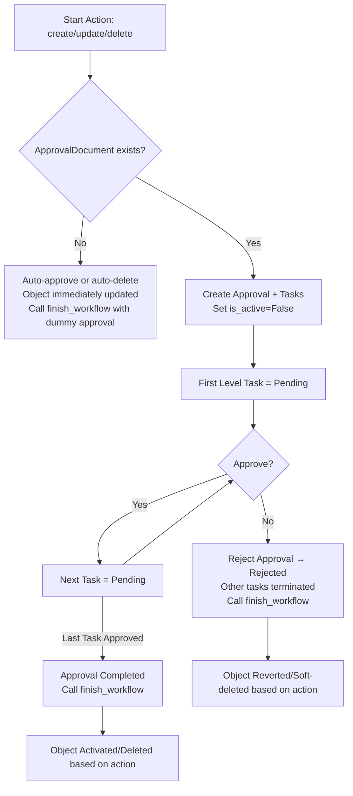

# 🚦 Approval Workflow Documentation

> **Overview**: This document explains how the multi-level approval system works for models that inherit from `BaseApprovableModel`.

---

## 🔑 Core Concepts

The approval system consists of several interconnected components:

### Primary Models

| Model | Purpose |
|-------|---------|
| **Action** | Defines what needs approval (create, update, delete, etc.) with unique auto-generated codes |
| **ApproverGroup** | Institution-scoped group of approvers (linked to roles and users) |
| **ApprovalDocument** | Workflow rules: Institution + ContentType + Actions |
| **ApprovalDocumentLevel** | A single step (level) in a workflow, with approvers/overriders |
| **Approval** | A workflow instance for a specific object + action |
| **ApprovalTask** | A single level's task inside an Approval |
| **BaseApprovableModel** | Abstract base class for models that need approval (triggers workflow) |

### Supporting Models

| Model | Purpose |
|-------|---------|
| **ApproverGroupRole** | Links roles to approver groups |
| **ApproverGroupUser** | Links individual users to approver groups |
| **ApprovalDocumentLevelApprovers** | Links approver groups to document levels |
| **ApprovalDocumentLevelOverriders** | Links overrider groups to document levels |

---

## ⚙️ Lifecycle Flow

### 1. 🎯 Trigger
- `confirm_create()` / `confirm_update()` / `confirm_delete()` is called on inheriting model
- `_trigger_approval()` looks up the workflow (`ApprovalDocument`) by:
  - Institution from `get_institution()` method
  - ContentType of the model
  - Specified action

### 2. 🛠️ Workflow Setup
- **No workflow configured** → object auto-activated or deleted immediately
  - Creates dummy approval for `finish_workflow()` hooks
  - Sets appropriate status directly
- **Workflow exists**:
  - Sets `is_active=False` during approval process
  - An `Approval` is created with `ongoing` status
  - `ApprovalTasks` are generated:
    - First task → `pending`
    - Others → `not_started`

### 3. ⚖️ Task Decisions
Approvers handle their task with two possible outcomes:

#### ✅ **Approve** (`mark_completed`)
- Task → `approved`
- Next task → `pending` (if exists)
- If last task → Approval → `completed`
- Calls `finish_workflow()` on completion

#### ❌ **Reject** (`mark_rejected`)
- Task → `rejected`
- Approval → `rejected`
- Remaining tasks → `terminated`
- Calls `finish_workflow()` immediately

### 4. 🏁 Finalization
`finish_workflow()` updates the object based on approval status and action:

| Approval Status | Action | Result on Object |
|----------------|--------|------------------|
| `completed` | **create** | `approval_status="active"`, `is_active=True`, `deleted_at=None` |
| `completed` | **update** | `approval_status="active"`, `is_active=True`, `deleted_at=None` |
| `completed` | **delete** | `approval_status="under_deletion"`, `is_active=False`, `deleted_at=now()` |
| `rejected` | **create** | `is_active=False`, `deleted_at=now()` (soft-deleted) |
| `rejected` | **update** | `approval_status="active"`, `is_active=True` (revert to active) |
| `rejected` | **delete** | `approval_status="active"`, `is_active=True` (revert to active) |

---

## 📊 State Transitions

### 🎯 Object Status (`approval_status`)
- `under_creation` → waiting for create confirmation
- `under_update` → waiting for update confirmation  
- `under_deletion` → waiting for delete confirmation
- `active` → fully approved & usable

### 📋 Task Status
- `not_started` → not yet reached in workflow
- `pending` → ready for approval by current level
- `approved` → accepted at this level
- `rejected` → denied at this level
- `terminated` → invalid due to rejection elsewhere in workflow

---

## 🔄 Workflow Diagram



---

## 📝 Example: Object Creation Workflow

Here's a step-by-step walkthrough of creating an object:

1. **Initiate**: Call `MyModel.confirm_create()`
   - Validates `approval_status == 'under_creation'`

2. **Lookup**: System finds `ApprovalDocument` for:
   - `MyModel`'s ContentType
   - Institution from `get_institution()`
   - `create` action

3. **Setup**: Creates `Approval` + tasks
   - Sets `is_active=False` on object
   - Level 1 = `pending`, others = `not_started`

4. **Processing**: 
   - Level 1 approvers call `mark_completed()` → Level 2 becomes `pending`
   - Continue until final level

5. **Completion**: Final level approves → Approval = `completed`

6. **Finalization**: `finish_workflow()` sets:
   - `approval_status="active"`
   - `is_active=True`
   - `deleted_at=None`

---

## 🔧 API Endpoints & Features

### Core CRUD Operations
- **Actions**: List, create, update, delete approval actions
- **Approver Groups**: Manage institution-scoped approval groups
- **Approval Documents**: Configure workflows for content types
- **Approval Document Levels**: Define approval steps and assign groups
- **Approvals**: View workflow instances
- **Approval Tasks**: Manage individual approval steps

### Dashboard Features
- **Pending Tasks**: Get user's pending approval tasks
- **Dashboard**: Comprehensive view of:
  - **Incoming**: Not started tasks (future levels)
  - **Open**: Currently pending for user
  - **Critical**: Pending > 5 days
  - **Expired**: Pending > 7 days  
  - **Outgoing**: Recently processed by user (last 7 days)

### Task Management
- **Approve Task**: `PATCH /tasks/{id}/approve/`
- **Reject Task**: `PATCH /tasks/{id}/reject/`
- Both support optional comments

### Content Type Discovery
- **Approvable Models**: Dynamic list of all models inheriting from `BaseApprovableModel`
- Auto-generates human-readable names from model classes

---

## 🏗️ Implementation Details

### Auto-Code Generation
- Actions get unique codes: `ACTION-{8-char-hex}` if not provided
- All models have `public_uuid` fields for external references

### Institution Scoping
- All workflows are institution-specific
- Users can only see/manage approvals within their institution
- `get_institution()` method required on approvable models

### User Authorization
- Approvers determined by:
  - Direct user assignment to approver groups
  - Role-based assignment (users with roles in approver groups)
- Overriders can skip levels (if implemented)

### Transaction Safety
- All approval state changes wrapped in database transactions
- Ensures consistency during complex multi-step operations

---

## 💡 Key Design Principles

> **Flexibility**: Workflows are configurable per institution, content type, and action combination

> **Safety**: Failed workflows revert objects to safe states; atomic transactions prevent inconsistencies  

> **Scalability**: Generic foreign keys allow any model to be approvable; role-based permissions scale with organization size

> **Auditability**: Complete approval history with timestamps, comments, and user tracking

---

## 🚀 Getting Started

### Making a Model Approvable
```python
class MyModel(BaseApprovableModel):
    # Your fields here
    
    def get_institution(self):
        return self.institution  # or however you determine institution
```

### Basic Usage
```python
# Create object in pending state
obj = MyModel.objects.create(name="test", approval_status='under_creation')

# Trigger approval workflow
obj.confirm_create()

# Object now has is_active=False until approved
```

### Required Setup
1. Create `Action` objects (create, update, delete, etc.)
2. Set up `ApproverGroup` with users/roles
3. Create `ApprovalDocument` linking institution + content type + actions
4. Add `ApprovalDocumentLevel` instances with approver groups
5. Objects will now require approval for specified actions