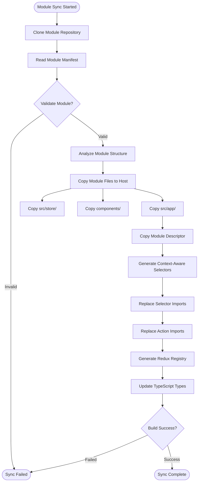
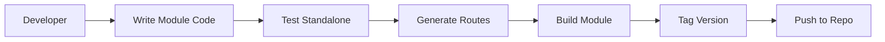
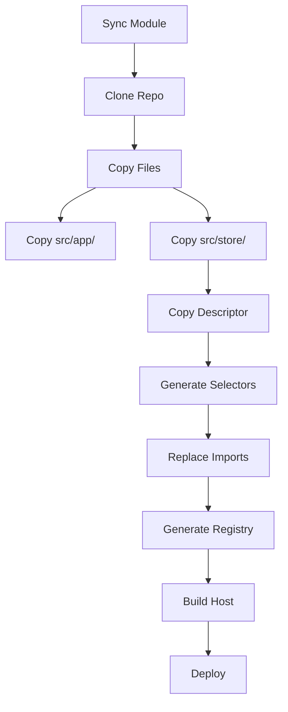

# Modular Architecture: Complete Guide

> **Comprehensive guide for building dual-life modules that work standalone and integrated**

---

## Table of Contents

1. [The Challenge](#the-challenge)
2. [Architectural Constraints](#architectural-constraints)
3. [Solutions Implemented](#solutions-implemented)
4. [Sync Flow Architecture](#sync-flow-architecture)
5. [Scripts and Automation](#scripts-and-automation)
6. [Complete Process Flow](#complete-process-flow)
7. [Best Practices](#best-practices)

---

## The Challenge

### Problem Statement

Build a Next.js application that can run in two modes:

1. **Standalone Mode**: As an independent application
2. **Integrated Mode**: As a module within a host platform

### Key Requirements

✅ **No code duplication** - Single codebase works in both modes  
✅ **No runtime loading** - Everything integrated at build time  
✅ **Proper isolation** - Module doesn't interfere with host  
✅ **Type safety** - Full TypeScript support in both modes  
✅ **Maintainable** - Clear separation of concerns  
✅ **Scalable** - Works with multiple modules  

### Why This is Hard

- **Different store structures** - Redux slices namespace differently
- **Different routing** - Module routes need prefixing
- **Different file locations** - Where does module code live?
- **Import resolution** - Absolute paths resolve differently
- **Action dispatching** - Actions must route to correct slices

---

## Architectural Constraints

### 1. Folder Structure

**Challenge**: Module structure must work in both standalone and integrated contexts

**Standalone Structure**:
```
module/
├── src/
│   ├── app/              # Next.js App Router
│   └── store/            # Redux store
├── components/
├── lib/
└── platform-integration/
```

**Integrated Structure**:
```
host-platform/
├── src/
│   ├── app/
│   │   └── apps/
│   │       └── task-management/    # ← Module goes here
│   │           ├── src/app/
│   │           └── src/store/       # ← Module's store
│   └── lib/
│       └── modules/
│           └── task-management.ts   # ← Module descriptor
```

**Solution**: Module uses consistent internal structure, host copies it during sync

---

### 2. Routing

**Challenge**: Routes need to work with and without mount path prefix

**Standalone**: `/dashboard`  
**Integrated**: `/apps/task-management/dashboard`

**Solutions Implemented**:

1. **Mount Path Configuration** (`module.json`):
```json
{
  "mountPath": "/apps/task-management"
}
```

2. **Navigation Utilities** (`src/platform-integration/navigation.ts`):
```typescript
export const buildModulePath = (path: string): string => {
  if (isStandalone) return path;
  return `${mountPath}${path}`;
};
```

3. **Module Router Hook** (`src/hooks/use-module-navigation.ts`):
```typescript
export function useModuleNavigation() {
  const router = useRouter();
  return {
    push: (route: string) => router.push(buildModulePath(route)),
    replace: (route: string) => router.replace(buildModulePath(route)),
  };
}
```

---

### 3. State Management

**Challenge**: Redux store structure differs between modes

**Standalone Store**:
```typescript
{
  auth: { user: {...} },
  miscellaneous: { sideBarOpened: true }
}
```

**Integrated Store**:
```typescript
{
  // Host slices
  auth: { user: {...} },
  miscellaneous: { sideBarOpened: true },
  
  // Module slices (namespaced)
  taskManagementAuth: { user: {...} },
  taskManagementMisc: { sideBarOpened: true }
}
```

**Solutions Implemented**:

1. **Context-Aware Selectors** (`src/store/auth/selectors-context-aware.ts`):
```typescript
export const selectUser = createContextAwareSelector(
  'auth',
  (authState) => authState?.user?.value
);
```

2. **Dynamic Context Detection** (`src/platform-integration/context-aware-selectors.ts`):
```typescript
export function createContextAwareSelector<T>(
  sliceName: string,
  selector: (sliceState: any) => T
) {
  return (state: any): T | undefined => {
    const sliceKey = getDynamicSliceKey(sliceName, state);
    // Returns correct slice based on context
  };
}
```

3. **Module Descriptor** (`src/platform-integration/module-descriptor.ts`):
```typescript
export const moduleDescriptor: ModuleDescriptor = {
  slices: {
    'taskManagementAuth': authReducer,
    'taskManagementMisc': miscReducer,
  },
};
```

---

### 4. Import Resolution

**Challenge**: Absolute imports (`@/store/auth/reducer`) must resolve correctly in both contexts

**Standalone**: `@/` resolves to module's `src/`  
**Integrated**: `@/` should resolve to module's synced files

**Solution**: Host platform copies module files maintaining structure:
```
Module → Host
src/store/ → src/app/apps/module/src/store/
```

---

## Solutions Implemented

### 1. Module Descriptor Pattern

**File**: `src/platform-integration/module-descriptor.ts`

Provides metadata about the module:
- Redux slices
- Sagas
- Routes
- Peer dependencies

**Purpose**: Host platform uses this to integrate the module

---

### 2. Context-Aware Selectors

**Files**:
- `src/store/auth/selectors-context-aware.ts`
- `src/store/miscellaneous/selectors-context-aware.ts`
- `src/platform-integration/context-aware-selectors.ts`
- `src/platform-integration/module-context.ts`

**Purpose**: Selectors that work in both standalone and integrated modes

**How it works**:
1. Detects current context (standalone vs integrated)
2. Determines correct slice key
3. Returns state from correct slice

---

### 3. Module Navigation Utilities

**Files**:
- `src/hooks/use-module-navigation.ts`
- `src/platform/v1/utils/routing.ts`
- `src/platform-integration/navigation.ts`

**Purpose**: Navigation that respects mount paths

**How it works**:
1. Detects if in standalone or integrated mode
2. Adds mount path prefix when needed
3. Maintains consistent URL structure

---

### 4. Sync Script Architecture

**Files**:
- `scripts/sync-module.mjs`
- `scripts/generate-module-routes.mjs`

**Purpose**: Automated module integration into host platform

---

## Sync Flow Architecture

### High-Level Architecture

```
┌─────────────────────────────────────────────────────────────┐
│                    MODULE REPOSITORY                         │
│                                                              │
│  ┌────────────────────────────────────────────────┐        │
│  │  Module Code (src/, components/, etc.)        │        │
│  └────────────────────────────────────────────────┘        │
│                                                              │
│  ┌────────────────────────────────────────────────┐        │
│  │  Module Descriptor (module-descriptor.ts)     │        │
│  └────────────────────────────────────────────────┘        │
│                                                              │
│  ┌────────────────────────────────────────────────┐        │
│  │  Module Manifest (module.json)               │        │
│  └────────────────────────────────────────────────┘        │
└─────────────────────────────────────────────────────────────┘
                           │
                           │ Git Clone (tagged version)
                           │
                           ▼
┌─────────────────────────────────────────────────────────────┐
│                    SYNC PROCESS                             │
│                                                              │
│  1. Clone Module Repository                                 │
│  2. Analyze Module Structure                                │
│  3. Copy Module Files to Host                               │
│  4. Update Imports (Selectors, Actions)                     │
│  5. Generate Host-Compatible Code                           │
│  6. Update Redux Registry                                    │
└─────────────────────────────────────────────────────────────┘
                           │
                           ▼
┌─────────────────────────────────────────────────────────────┐
│                    HOST PLATFORM                             │
│                                                              │
│  ┌────────────────────────────────────────────────┐        │
│  │  src/app/apps/task-management/                 │        │
│  │    ├── Module Routes & Components              │        │
│  │    └── src/store/ (Module's Reducers)          │        │
│  └────────────────────────────────────────────────┘        │
│                                                              │
│  ┌────────────────────────────────────────────────┐        │
│  │  src/lib/modules/                               │        │
│  │    ├── task-management.ts (Descriptor)         │        │
│  │    ├── task-management-selectors.ts             │        │
│  │    └── task-management-actions.ts               │        │
│  └────────────────────────────────────────────────┘        │
│                                                              │
│  ┌────────────────────────────────────────────────┐        │
│  │  src/lib/redux/registry.ts                     │        │
│  │    └── Combines all reducers                   │        │
│  └────────────────────────────────────────────────┘        │
└─────────────────────────────────────────────────────────────┘
```

### Detailed Sync Flow



---

## Scripts and Automation

### 1. Module Route Generator

**File**: `scripts/generate-module-routes.mjs`

**Purpose**: Automatically scan module for routes and update configuration

**What it does**:
1. Scans `src/app/` for `page.tsx` files
2. Converts file paths to routes
3. Prompts for mount path (with `apps/` prefix)
4. Updates `module.json` with mount path and routes
5. Updates `module-descriptor.ts` with routeBasePath
6. Generates `module.routes.json`

**Usage**:
```bash
npm run generate-routes
```

**Input**: User enters module name (e.g., "task-management")  
**Output**: Auto-prepends `apps/` prefix, creates `/apps/task-management`  

**Example**:
```
Enter the module name: task-management
✅ Mount path: /apps/task-management
📋 Found 55 routes
✅ Updated module.json
✅ Updated module-descriptor.ts
```

---

### 2. Module Sync Script (Host Platform)

**File**: `scripts/sync-module.mjs` (in host platform)

**Purpose**: Synchronize a module from Git repository to host platform

**What it does**:

1. **Clone Module**:
```javascript
git clone --branch v1.0.0 <module-repo> /tmp/module-sync
```

2. **Copy Module Files**:
```javascript
// Copy app files
copyDir('src/app/', 'src/app/apps/task-management/');

// Copy store files (IMPORTANT!)
copyDir('src/store/', 'src/app/apps/task-management/src/store/');
```

3. **Generate Selectors**:
```javascript
// Create context-aware selectors
generateSelectors('task-management', {
  'taskManagementAuth': 'auth',
  'taskManagementMisc': 'miscellaneous'
});
```

4. **Replace Imports**:
```javascript
// Replace in module files
replaceImports({
  '@/store/auth/selectors-context-aware': '@/lib/modules/task-management/selectors'
});
```

5. **Generate Registry**:
```javascript
// Update Redux registry
updateRegistry({
  taskManagementAuth: 'taskManagementAuthReducer',
  taskManagementMisc: 'taskManagementMiscReducer'
});
```

**Usage**:
```bash
node scripts/sync-module.mjs \
  --repo "https://github.com/org/task-management-module" \
  --tag "v1.0.0" \
  --name "task-management"
```

---

### 3. Build Process

**Module Build** (Standalone):
```bash
# In module repository
npm run build
# Output: .next/ directory with standalone build
```

**Host Platform Build** (Integrated):
```bash
# In host platform
npm run build
# Includes all integrated modules
```

---

## Complete Process Flow

### Module Development Flow



### Host Integration Flow



### Detailed Step-by-Step Process

#### Phase 1: Module Development

**Step 1**: Develop module with standard Next.js structure
```
✅ Create src/app/ with routes
✅ Create src/store/ with Redux slices
✅ Create components/
✅ Implement business logic
```

**Step 2**: Create platform integration layer
```
✅ Add module-descriptor.ts
✅ Add context-aware selectors
✅ Add navigation utilities
✅ Add platform API exports
```

**Step 3**: Generate module configuration
```bash
npm run generate-routes
# Input: "task-management"
# Output: module.json, module-descriptor.ts updated
```

**Step 4**: Test in standalone mode
```bash
npm run dev
# Test all routes, features, state management
```

**Step 5**: Commit and tag
```bash
git add .
git commit -m "feat: complete module implementation"
git tag -a v1.1.0 -m "Release v1.1.0"
git push origin main --tags
```

---

#### Phase 2: Host Platform Integration

**Step 1**: Host platform syncs module
```bash
node scripts/sync-module.mjs \
  --repo "https://github.com/org/task-management" \
  --tag "v1.1.0" \
  --name "task-management"
```

**Step 2**: Sync script executes:

1. **Clones repository**
```javascript
git clone --branch v1.1.0 <repo> /tmp/module-sync
```

2. **Copies module files**
```
Module Structure:
  src/app/     → host/src/app/apps/task-management/
  src/store/   → host/src/app/apps/task-management/src/store/
  components/  → host/src/app/apps/task-management/src/components/
```

3. **Copies module descriptor**
```
src/platform-integration/module-descriptor.ts
  → host/src/lib/modules/task-management.ts
```

4. **Generates context-aware selectors**
```typescript
// Creates: host/src/lib/modules/task-management/selectors.ts
export const selectUser = (state: RootState) => 
  state.taskManagementAuth?.user?.value;

export const selectSideBarOpened = (state: RootState) => 
  state.taskManagementMisc?.sideBarOpened;
```

5. **Replaces imports in module files**
```typescript
// FROM:
import { selectUser } from "@/store/auth/selectors-context-aware";

// TO:
import { selectUser } from "@/lib/modules/task-management/selectors";
```

6. **Generates Redux registry**
```typescript
// Creates: host/src/lib/redux/registry.ts
export const rootReducer = combineReducers({
  // Host slices
  auth: hostAuthReducer,
  miscellaneous: hostMiscReducer,
  
  // Module slices
  taskManagementAuth: taskManagementAuthReducer,
  taskManagementMisc: taskManagementMiscReducer,
});

export function* rootSaga() {
  yield all([
    fork(hostSagas),
    fork(taskManagementSagas),
  ]);
}
```

**Step 3**: Build host platform
```bash
npm run build
# Should succeed with module integrated
```

**Step 4**: Test integrated module
```bash
npm run dev
# Visit: http://localhost:3000/apps/task-management/dashboard
# Test all module functionality
```

**Step 5**: Deploy
```bash
npm run deploy
# Module is now live in production
```

---

## Best Practices

### 1. Module Development

- ✅ Use absolute imports (`@/store/auth/reducer`)
- ✅ Create context-aware selectors for all slices
- ✅ Use `useModuleNavigation` for navigation
- ✅ Test in standalone mode before tagging
- ✅ Version module tags (semver)
- ✅ Document module dependencies

### 2. Host Platform Integration

- ✅ Copy entire module structure
- ✅ Generate selectors for each module
- ✅ Update Redux registry automatically
- ✅ Validate sync before completing
- ✅ Test build after each sync
- ✅ Handle module updates gracefully

### 3. State Management

- ✅ Namespace module slices (e.g., `taskManagementAuth`)
- ✅ Use context-aware selectors
- ✅ Actions automatically work (no changes needed)
- ✅ Keep reducers with module files
- ✅ No duplicate code

### 4. Routing

- ✅ Mount paths start with `apps/`
- ✅ Use `buildModulePath()` for URLs
- ✅ Test routes in both modes
- ✅ Handle nested routes correctly

---

## Summary

### What We Built

A **dual-life module system** that works in:
- ✅ **Standalone mode**: Independent Next.js application
- ✅ **Integrated mode**: Embedded within a host platform

### How It Works

1. **Module** defines its structure via `module-descriptor.ts`
2. **Host** syncs module via Git repository
3. **Sync script** automates integration:
   - Copies module files
   - Generates context-aware code
   - Updates Redux registry
4. **Module works** seamlessly in both modes

### Key Achievements

✅ No code duplication  
✅ No runtime loading  
✅ Type-safe throughout  
✅ Automated integration  
✅ Scalable architecture  
✅ Maintainable codebase  


